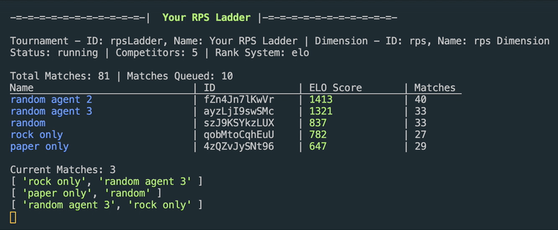

# Kaggle RPS Tournament Runner / Gym

This code allows you to run a local tournament ranking bots you provide by the ELO ranking algorithm (somewhat similar to the current Kaggle leaderboard ranking system), or Trueskill or Total Wins and Losses

Ensure you have [NodeJS](https://nodejs.org/) version 12.x or above installed and [Kaggle Environemnts](https://github.com/Kaggle/kaggle-environments/) python package installed and updated. Note that pure Windows does not work, you need WSL, to install, see this https://github.com/KNOXDEV/wsl

To run the tournament, fork this repo or clone it to your computer, and first install the [Dimensions](https://github.com/stonet2000/dimensions) package

```
npm install dimensions-ai
```

then run

```
node run.js
```



to see a live display of a leaderboard of 5 agents. Sample agents are paper only, rock only, and random agents.

## Configuration

You can configure which agents you want to run in the `botlist` variable in `configs.js`

Within the configs variable `configs.js`, you can also change a number of other configurations from ranking system to when you want the tournament to end to max concurrent matches to run. Documentation is in `configs.js`

If you would like to configure the kaggle RPS configurations, see `main.py`, you can change e.g. the episodeSteps configurations.

## Retrieving data live from Tournament

By default, the API to retrieve such data is turned off. To turn it on, change `activateAPI` in `configs.js` to `true`.

This will serve an API at `localhost:9000`. See https://github.com/StoneT2000/Dimensions/wiki/Dimensions-Station-API for a description of how to use the API. Through the API, you can retrieve rankings, start and stop a tournament and more.

At the moment, `run.js` sets the IDs as follows
`dimensionID: rps`, `tournamentID: rpsLadder`

So a route in the shape of `/api/dimensions/:dimensionID/tournament/:tournamentID/ranks` becomes `/api/dimensions/h4/tournament/h4ladder/ranks` which a get request to that route gives you all the rankings in JSON format.
